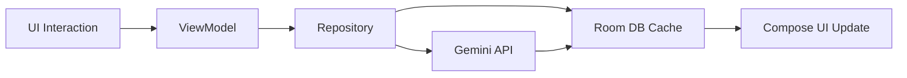

<div align="center">


# 🚀 TASKFLOW AI

</div>

---

TaskFlow AI is a production-grade Android task management system engineered for high-performance productivity. By integrating Google's Gemini AI with an offline-first architecture, it provides a seamless "zero-latency" experience for creating and organizing tasks through natural language.

---

### 🎯 PROJECT OVERVIEW

TaskFlow AI addresses the friction of traditional task entry. Instead of complex forms, users interact with an **Intelligent Parsing Engine** that decodes natural intent into structured data. It follows **Clean Architecture** principles to ensure the system is scalable, testable, and maintainable.

### 🏆 KEY HIGHLIGHTS

*   **Offline-First Reliability:** 100% functionality without internet via rule-based fallback.
*   **Zero-Latency AI:** Smart Caching layer reduces AI response time from seconds to milliseconds.
*   **Memory Efficient:** Optimized Room persistence and diff-util based UI updates.
*   **Clean Architecture:** Strict separation of layers (Presentation, Domain, Data).

---

### ✨ CORE FEATURES

#### 🤖 Intelligent Task Management
*   **Natural Intent Parsing:** Convert "Gym tomorrow at 6am" into a structured task automatically.
*   **Smart Caching Layer:** Reuse AI results for similar prompts to minimize API costs and battery drain.
*   **Offline Fallback Engine:** High-performance Regex-based parsing when the cloud is unreachable.

#### 📅 Visualization & Analytics
*   **Dynamic Calendar Engine:** Full monthly grid with intelligent deadline highlighting.
*   **Productivity Insights:** Weekly completion metrics and achievement streak tracking.
*   **Real-time Dashboard:** Live countdowns for immediate priorities.

#### 🔔 Notification & Automation
*   **Exact-Time Alarms:** Precision reminders using Android's AlarmManager.
*   **Daily AI Summaries:** Motivational morning briefings generated by Gemini.
*   **Background Resilience:** Auto-reschedules reminders on device reboot.

---

### 🏗️ SYSTEM ARCHITECTURE

```text
┌──────────────────────────────────────────────────────────┐
│                   PRESENTATION LAYER                     │
│      (Jetpack Compose + MVVM + StateFlow + Hilt)         │
└───────────────┬────────────────────────────┬─────────────┘
                │                            │
┌───────────────▼─────────────┐   ┌──────────▼─────────────┐
│       DOMAIN LAYER          │   │      UI COMPONENTS     │
│  (Use Cases + Repositories) │   │   (Material 3 Design)  │
└───────────────┬─────────────┘   └──────────┬─────────────┘
                │                            │
┌───────────────▼────────────────────────────▼─────────────┐
│                        DATA LAYER                        │
│   (Room DB + Gemini API + Firestore Sync + WorkManager)  │
└──────────────────────────────────────────────────────────┘
```

#### 🧵 Threading & Data Flow


---

### 📁 PROJECT STRUCTURE

```text
com.example.todoapp
├── ai               # Intelligent Parsing & Gemini Integration
├── data             # Room Persistence & Repository Implementations
├── di               # Hilt Dependency Injection Modules
├── domain           # Business Logic Interfaces & Entities
├── notifications    # WorkManager & AlarmManager Logic
├── ui               # Presentation Layer
│   ├── navigation   # Compose Navigation Graph
│   ├── screens      # Feature-specific UI (Home, Calendar, Stats)
│   └── theme        # Material 3 Design System
└── ToDoApp.kt       # Application Class & Worker Initialization
```

---

### 🛠️ TECH STACK

| Category | Technology | Purpose |
| :--- | :--- | :--- |
| **Language** | Kotlin | Primary Language |
| **Architecture** | MVVM | Clean Separation of Concerns |
| **UI** | Jetpack Compose | Modern Declarative UI (Material 3) |
| **DI** | Dagger Hilt | Compile-time Dependency Injection |
| **Database** | Room | Local Persistence & AI Cache |
| **AI** | Gemini 1.5 Flash | Natural Language Processing |
| **Async** | Coroutines / Flow | Reactive Stream Processing |
| **Background** | WorkManager | Reliable Background Execution |

---

### 🚀 QUICK START

#### Prerequisites
*   Android Studio Koala+
*   JDK 17
*   Gemini API Key

#### Installation
1.  Clone the repository:
    ```bash
    git clone https://github.com/Vasu-Nandan20/TO-DO-APP.git
    ```
2.  Add your API key to `local.properties`:
    ```properties
    GEMINI_API_KEY=your_key_here
    ```
3.  Build & Run using Android Studio.

---

### 👤 AUTHOR

**Vasu Nandan**
*   GitHub: [@Vasu-Nandan20](https://github.com/Vasu-Nandan20)
*   Email: [vasunandan2006@gmail.com](mailto:vasunandan2006@gmail.com)

---

### 📄 LICENSE

This project is licensed under the MIT License - see the [LICENSE](LICENSE) file for details.
